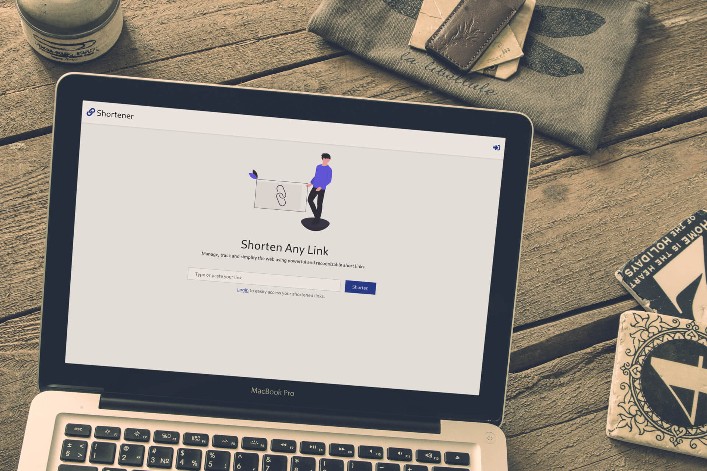

# URL Shortener

> Shorten any link using this URL shortener web application.



## Features

- Unauthenticated and logged in users can shorten URLs
- Users can view analytics on their shortened URLs
- Logged in users can view and access the analytics of the URLs they shortened
- Analytics of URLs shortened by authenticated users are protected and can't be viewed by anyone else

## Built With

- Rails
- Bootstrap
- Stimulus.js
- Chartkick
- Font Awesome

## Getting Started

To get a local copy up and running follow these simple example steps.

### Prerequisites

- Ruby 2.6.5
- yarn

### Setup

```bash
# Clone the repo
git clone https://github.com/meronokbay/Chunin-Exam

# cd into the cloned repo
cd Chunin-Exam
```

### Install

```bash
bundle install
yarn install
```

### Usage

```bash
# Create database
rails db:create

# Run migrations
rails db:migrate

# Seed the database with a test account(email: 'test@example.com', password: '123456')
rails db:seed

# Start your Rails server
rails server

# In a separate tab
bin/webpack-dev-server
```

Go to your favorite web browser and visit `http://localhost:3000`.

### Run tests

```bash
bundle exec rspec
```

## Author

👤 **Meron Ogbai**

- Github: [@meronokbay](https://github.com/meronokbay)
- Twitter: [@MeronDev](https://twitter.com/MeronDev)
- Linkedin: [Meron Ogbai](https://linkedin.com/in/meron-ogbai/)

## 🤝 Contributing

Contributions, issues, and feature requests are welcome!

## Show your support

Give a ⭐️ if you like this project!

## Acknowledgments

- [undraw](https://undraw.co/)
- [ Shuvo Acharjee](https://dribbble.com/shots/11777863-Link-Shortener-Landing-Page-Concept)

## 📝 License

This project is [MIT](./LICENSE) licensed.
